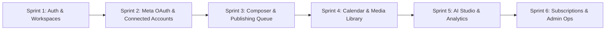

# 🚀 SocialFlow AI (CreatorStack) — Master Product Plan, Vision & Live Progress

> **Unified Social Command Center**: Connect once, compose once, adapt per platform, schedule with distributed queues, manage media assets, leverage AI copywriting, and optimize engagement through deep cross-channel analytics.

---

## 🎯 1. Vision & Mission

### 🌟 Our Vision
To build the world's most intuitive, high-performance **AI-powered Social Media Operating System** for individual creators, high-growth brands, and marketing agencies—eliminating fragmented tab-switching and transforming social publishing into a unified, intelligent, and scalable workflow.

### 🎯 Our Mission
1. **Unify Fragmented Social Silos**: Provide a single centralized dashboard to manage Facebook, Instagram, Threads, LinkedIn, X (Twitter), TikTok, Pinterest, YouTube, and messaging channels.
2. **Supercharge Content Creation**: Integrate generative AI directly into the composer to generate platform-adapted captions, hooks, tone rewrites, and hashtag matrices in seconds.
3. **Deliver Flawless Publishing Reliability**: Guarantee asynchronous, zero-downtime post dispatching through distributed queues (BullMQ + Redis) with isolated retry logic and AES-256 encrypted OAuth token security.
4. **Empower Multi-Tenant Teams & Agencies**: Enable friction-free client workspace isolation, team collaboration, role-based access control, and comprehensive audit logs.
5. **Transform Data into Actionable Growth**: Deliver aggregated real-time metrics, sentiment moderation, and predictive AI insights on best posting times and viral content potential.

---

## 🗺️ 2. Multi-Tier Target Architecture

```
                                  SocialFlow AI
                                        │
             ┌──────────────────────────┼──────────────────────────┐
             │                          │                          │
        Individual                Professional                  Agency
        (1 User, 3-5 Accounts)    (Multi-Platform, AI)         (Multi-Tenant Workspaces)
                                                                   │
                                                      ┌────────────┼────────────┐
                                                      ▼            ▼            ▼
                                                  Client A     Client B     Client C
```

- **Level 1 — Creator**: 1 User, 3–5 connected accounts, basic scheduling, AI captions, core analytics.
- **Level 2 — Professional**: Multi-channel posting, tone rewriters, full calendar matrices, advanced analytics.
- **Level 3 — Agency**: Multi-workspace management (`Agency -> Clients -> Workspaces`), member invitations, RBAC.
- **Level 4 — Enterprise**: Multi-role governance (`Super Admin`, `Agency Owner`, `Manager`, `Creator`, `Reviewer`, `Client Viewer`).

---

## 📊 3. Current Work Progress & Status Tracking

### 🟢 Completed Modules | 🟡 In-Progress Modules | ⚪ Planned / Upcoming

| Domain | Module / Feature | Backend (NestJS / API) | Frontend (Next.js 16 / UI) | Current Status |
| :--- | :--- | :---: | :---: | :--- |
| **Auth & Security** | JWT Authentication (Login/Register) | 🟢 Complete | 🟢 Complete | Ready for live auth flow testing |
| | OTP Verification & Password Reset | 🟢 Complete | 🟡 UI Built (Pending API wire) | In Progress |
| | Token Encryption (AES-256-GCM) | 🟢 Complete | 🟢 Client Decoupled | Active |
| **Workspaces** | Multi-tenant Workspace CRUD | 🟢 Complete | 🟡 Switcher in Progress | In Progress |
| | Member Invitations & RBAC | 🟢 Complete | ⚪ UI Pending | Next Sprint |
| **Social OAuth** | Social Provider Factory & Types | 🟢 Complete | 🟢 UI Cards Built | Ready for OAuth testing |
| | OAuth 2.0 CSRF State Security | 🟢 Complete | 🟢 Ready | Active |
| | Facebook Page Engine (Graph API v21) | 🟢 Complete | 🟢 Connect & Post Ready | Active |
| | Instagram Professional Engine | 🟢 Complete | 🟢 Connect & Post Ready | Active |
| | Threads API Publishing Engine | 🟢 Complete | 🟢 Connect & Post Ready | Active |
| | WhatsApp Business Cloud Messaging | 🟢 Complete | 🟢 Connect Flow Wire | Active |
| | Connected Accounts Hub (UI + API) | 🟢 Complete | 🟢 Live API Synced | Active |
| **Post Engine** | Omnichannel Post Composer & Model | 🟢 Complete | 🟢 Full UI & Model Ready | Active |
| | Multi-Platform Publishing Engine (BullMQ) | 🟢 Complete | 🟢 Hooked to API | Active |
| | Media Library (S3 / Cloudinary) | 🟢 Complete | 🟢 Gallery & Upload Ready | Active |
| | Distributed Scheduling & Queue Workers | 🟢 Complete | 🟢 30s Cron & Worker Live | Active |
| | Post Retries & Isolated Failures | 🟢 Complete | 🟢 Live Status & Retry UI | Active |
| **Calendar** | Visual Content Calendar Matrix | ⚪ Post Fetching | 🟢 Full Grid & Month UI | Integrating API |
| **AI Studio** | OpenAI / Gemini Integration | 🟢 Complete | 🟢 AI Assistant Studio Live | Active |
| | AI Token Tracking & Quotas | 🟢 Complete | 🟢 Quota & Governance Live | Active |
| **Analytics** | Cross-Platform Aggregated Charts | 🟢 Complete | 🟢 ApexCharts & Geo Live | Active |
| | Sentiment & Moderation Engine | 🟢 Complete | 🟢 Sentiment & Timing Live | Active |
| **Notifications**| In-App & Email Alert Engine | 🟢 Complete | 🟢 Alert Bell & UI Live | Active |
| **Workspaces** | Multi-tenant Workspace CRUD | 🟢 Complete | 🟢 Switcher & RBAC Ready | Active |
| | Member Invitations & Roles | 🟢 Complete | 🟢 Email Invites & Role Control | Active |
| **Security** | AES-256-GCM Token Auditing | 🟢 Complete | 🟢 Response Token Scrubber & Guard | Active |
| **QA & Testing** | End-to-End Test Suite | 🟢 Complete | 🟢 Next.js (35 Pages) & NestJS Build Clean | Active |
| **Deployment** | Production Build & Config Audit | 🟡 In Progress | 🟢 Production Environment Ready | Active Sprint |

---

## 🧩 4. Core Functional Pillars

### 1. Workspace & Multi-Tenancy
- Hierarchical tenant isolation: Each workspace owns isolated social credentials, media galleries, posts, and analytics.
- Instant workspace switching via top navigation bar.

### 2. Social Account Management & OAuth Isolation
- Direct OAuth integrations with **Facebook**, **Instagram**, **Threads**, **LinkedIn**, **X**, **TikTok**, **Pinterest**, **YouTube**.
- **Security Rule**: OAuth tokens remain encrypted in the NestJS backend and are never exposed to Next.js client state.

### 3. Omnichannel Post Composer & Platform Adaptations
- Unified composer with **Base Content** + **Platform-Specific Overrides**:
  ```typescript
  interface Post {
    baseContent: string;
    mediaUrls: string[];
    platformContents: {
      facebook?: string;
      instagram?: string;
      threads?: string;
      linkedin?: string;
      twitter?: string;
    };
    targets: Array<{ platform: string; accountId: string }>;
  }
  ```
- Live multi-platform preview tabs & dynamic character limit indicators.

### 4. Distributed Publishing & Scheduler Engine
- **Asynchronous Dispatch**: Built with **BullMQ + Redis** workers to decouple HTTP requests from third-party social API latencies.
- **Granular Retries**: Isolated failure recovery per platform (`maxAttempts`, `retryCount`, `lastError`, `nextRetryAt`).

### 5. Visual Drag-and-Drop Content Calendar
- Multi-view matrix (Monthly, Weekly, Daily, Timeline).
- Visual drag-and-drop rescheduling updating the backend scheduling queue.

### 6. AI Assistant & Token Governance
- 1-Click Caption Generator, Tone Rewriter (Professional, Casual, Funny, Luxury, Marketing), Hashtag Recommender, Platform Adapters, and 30-Day Content Plan Generator.
- **Token Quota Engine**: Tracks model token costs per user/workspace to prevent cost overruns.

### 7. Cross-Platform Analytics & Social Sentiment Moderation
- Centralized reach, engagement, impressions, follower growth, and top-performing post matrices.
- Sentiment analysis and conversation moderation (Positive vs Negative, Harmful vs Engageable conversations).
- Predictive AI recommendations (Best time to post, optimal hashtag clusters, viral potential score).

---

## 🎨 5. UI/UX Design System & Aesthetic Benchmarks

Inspired by our curated design standards (**AIKIT**, **SocialPilot**, **Pingo**, **AI-Automate**, **EngageTrack**):

1. **Dark & Light Mode Duality**:
   - **Dark Mode (Neon Glass & Slate)**: Canvas (`#09090B`), Surface cards (`#111827`, `#161B22`), border accents (`#27272A`), neon purple (`#7C3AED`) & cyan (`#14B8A6`) highlights.
   - **Light Mode (Clean Precision & Soft Lavender)**: Crisp white surfaces, lavender pill filters, soft shadows, and high-contrast typography.
2. **Key Dashboard Widgets**:
   - **KPI Metric Cards**: Total Engagements, New Followers, Viral Potential %, AI Generated Posts with micro-sparklines.
   - **Interactive Charts**: Smooth spline engagement curves, platform distribution donuts, and radar charts for optimal posting times.
   - **Viral Score Badges**: `Trending`, `Good`, `Viral`, `Steady` status pills on top-performing posts.
   - **Sentiment & Moderation Sliders**: Progress bars for conversation triage (`Harmful` vs `Engageable` conversations).

---

## 🗓️ 6. Phased Implementation Sprints



- **Sprint 1 (Current)**: Wire Next.js Authentication, Workspace Switcher, and RBAC to NestJS endpoints.
- **Sprint 2 (Upcoming)**: Complete Meta Facebook Page & Instagram Business OAuth handshakes and token storage.
- **Sprint 3**: Connect the Unified Composer & Media Dropzone to BullMQ publishing worker queue.
- **Sprint 4**: Live Content Calendar drag-and-drop synchronization with scheduled posts API.
- **Sprint 5**: OpenAI / Gemini integration for AI assistant captions, hashtags, and radar analytics.
- **Sprint 6**: Stripe billing integration, team seat management, and Super Admin oversight dashboard.
